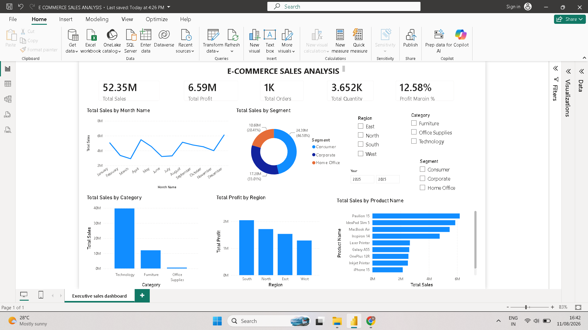

Executive Sales & Profit Dashboard:

 📊 Project Overview:

An interactive Power BI dashboard designed to analyze sales performance, profitability, and business trends.

The dashboard provides a clear overview of key business metrics and helps identify high-performing products, regions, and sales trends.

 🛠️ Tools Used:

- Microsoft Power BI
- Microsoft Excel
- Power BI Data Visualization
- Data Cleaning & Transformation

 📈 Dashboard Features:

- Total Sales
- Total Profit
- Sales and Profit trends
- Regional performance
- Product/category analysis
- Interactive filters and slicers
- KPI cards and visualizations

 🎯 Objective:

The objective of this project is to transform raw sales data into an interactive business dashboard that can support data-driven decision making.

 📷 Dashboard Preview:

 📁 Project Files

- `.pbix` — Power BI dashboard file
- `.png` — Dashboard screenshot

💡 Key Learning:

Through this project, I practiced data cleaning, data modeling, creating visualizations, using Power BI measures, and designing an interactive business dashboard.

Use Control + Shift + m to toggle the tab key moving focus. Alternatively, use esc then tab to move to the next interactive element on the page.
No file chosen
Attach files by dragging & dropping, selecting or pasting them.
